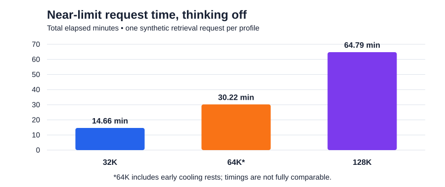

# Qwen3.8 on a SER8 with 64 GB RAM

A practical Ollama setup for the Beelink SER8 with Ryzen 7 8845HS, Radeon 780M and 64 GB DDR5 memory. It includes 8K and 16K everyday profiles and opt-in 32K, 64K and 128K profiles for larger documents and codebases.

**Summary:** Use 8K for focused interactive work, and 16K when a prompt needs extra room. Use 32K for multi-file coding or document review. Reserve 64K and 128K for material that will not fit smaller profiles: near-limit requests in the latest tests took 25–29 minutes at 64K and 63–74 minutes at 128K. Shorter everyday prompts were not measured in this matrix. Every synthetic retrieval check passed, but these tests do not establish general reasoning or coding quality.

The benchmark machine was Windows 11; this setup guide targets native Linux. Linux performance has not been measured here, and driver, Ollama backend, power and memory differences can change results. WSL and Docker GPU setup are outside this guide. See [benchmark run instructions](BENCHMARKING.md) for reproducibility and run controls.

## Reported benchmark configuration

| Setting | Tested configuration |
|---|---|
| Model | `qwen3.8:27b-mtp-q4_K_M` (27.3B, pinned weights) |
| GPU backend | Vulkan, full reported placement on Radeon 780M |
| MTP draft tokens | 2 |
| CPU threads / batch | 6 / 256 |
| KV cache / Flash Attention | f16 / automatic |
| Concurrent requests / loaded models | 1 / 1 |
| Profile sampling | temperature 0, top-k 20, top-p 0.95, min-p 0 |

Earlier 512-token comparisons measured 7.16–8.11 tokens/sec with MTP draft 2 versus 3.77–4.10 with draft 0; those requests hit their output limits. The dedicated 2026-09-26 context test measured 57.07 seconds for 3,395 uncached prompt tokens and 149.46 seconds for 8,583. These are performance observations, not answer-quality comparisons. See the [original report](benchmarks/2026-09-26/README.md) for source data and qualifications.

## The profiles

| Profile | Context budget | Recommended tasks |
|---|---:|---|
| `ser8-qwen38:8k` | 8,192 tokens | Interactive chat, focused code edits, short documentation tasks |
| `ser8-qwen38:16k` | 16,384 tokens | A few files, a longer specification, focused documentation drafting |
| `ser8-qwen38:32k` | 32,768 tokens | Multi-file coding, repository questions, comparing several documents |
| `ser8-qwen38:64k` | 65,536 tokens | Large codebase or document set when 32K cannot hold the needed context |
| `ser8-qwen38:128k` | 131,072 tokens | One-off analysis of a very large corpus that cannot be split or retrieved selectively |

All profiles use `num_thread=6`, `num_batch=256`, `draft_num_predict=2` and
`temperature=0`. Temperature 0 matches the benchmarks; it is a sampling choice,
not a universal quality recommendation. Context includes input, history and output.
Profiles inherit the source template and projector and reuse the same model blobs.

## Linux setup

Requirements: Git (for cloning), Bash, Python 3, Ollama with Vulkan and this model's MTP support,
and a working AMD Vulkan driver. Install Ollama using the [official Linux
instructions](https://docs.ollama.com/linux); 0.34.2 is the benchmark reference.
The standard `ollama.service` is assumed below.

Check GPU access using `vulkaninfo --summary` (install your distribution's Vulkan
tools if needed). The GPU must also be accessible to the service account. Ollama's
[hardware guide](https://docs.ollama.com/gpu) notes that the service user may need
membership in `render`. Check `ls -l /dev/dri/` and the service's user before
changing permissions; do not run the daemon as root to work around GPU access.

Run these commands on the Linux SER8. Clone the repository and enter its root:

```bash
git clone https://github.com/andrii2g/ollama-on-ser8.git
cd ollama-on-ser8
```

If you already downloaded or cloned the project, open its root directory instead.
Run all following commands from that directory.

### Host configuration

The supplied scripts connect only to `127.0.0.1:11434`. The profile creation and
chat helpers override an inherited `OLLAMA_HOST`; the Python API checks also use
that fixed address. There is currently no `.env` loading or remote-host support
in these helpers.

For CLI commands, `OLLAMA_HOST` selects the server to connect to. In the systemd
drop-in and `ollama serve` command, it sets the server's listening address. This
setup uses localhost for both. Set the client host explicitly so downloads and
checks reach the same server as the helpers:

```bash
export OLLAMA_HOST=127.0.0.1:11434
```

This export applies only to the current shell; repeat it in new terminals, or
use the inline assignments shown below. Local graphical/API clients should
connect to `http://127.0.0.1:11434`.

### Install the service configuration and profiles

```bash
# Install a persistent systemd drop-in. Uses sudo where needed.
bash scripts/configure-server.sh

# Finish any running work; stop each loaded model shown by ollama ps.
ollama ps
# ollama stop EXACT_MODEL_NAME
sudo systemctl restart ollama

# Download once (or reuse the already-downloaded explicit tag).
ollama pull qwen3.8:27b-mtp-q4_K_M

# Create and verify both profiles. Run as your normal user.
bash scripts/apply-profiles.sh
```

The service drop-in enables Vulkan/iGPU use, one parallel request, one loaded
model, an 8K default context, f16 KV cache and a 15-minute keep-alive. It leaves
Flash Attention and device selection automatic. Other service overrides can
conflict: inspect `systemctl cat ollama` if placement differs. The 16K model's
saved `num_ctx` overrides the server's 8K default unless a client overrides it.

The installer backs up its own existing drop-in and does not restart the daemon
automatically. Profile creation verifies the exact tested source manifest:

```text
22130167c4c20e20c7b71454612966ca8e8171e9b3cc8ab6ce8aa6cbfec79643
```

If the tag changes, creation stops before changing profiles. Do not substitute
`latest` or remove the check without reviewing and testing the new weights.

## Optional large-context profiles

The default installer still creates only 8K and 16K. Create the larger profiles
explicitly after downloading and verifying the source model:

```bash
bash scripts/apply-profiles.sh 32k 64k 128k
bash scripts/use-profile.sh 32k   # or 64k / 128k
```

After sending a message, check the allocated context and placement in another
terminal:

```bash
bash scripts/verify-profile.sh 32k   # match the profile you used
```

These profiles reuse the model weights; they increase runtime memory requirements.
Context includes the prompt, conversation history, and generated output. A model
loading successfully does not establish that near-limit prompts are fast or that
all input is retained. Keep output headroom and check server logs for truncation.

## Benchmark results

These Windows measurements used the pinned 27.3B Q4_K_M model, Vulkan/MTP draft 2, six threads, batch 256, f16 KV cache and one request at a time. For profiles, prompts, raw evidence and run instructions, see the [benchmarking guide and linked reports](BENCHMARKING.md).

### 32K–128K retrieval results (2026-09-27)



All three completed requests retrieved the beginning, middle and end codes. The test used thinking off and a 256-token output cap.

| Profile | Allocated context | Prompt tokens | First token | Total request | Generation speed | Result |
|---|---:|---:|---:|---:|---:|---|
| 32K | 32,768 | 28,461 | 13.85 min | 14.66 min | 5.32 tok/s | All codes correct; output cap reached |
| 64K | 65,536 | 57,060 | 29.30 min | 30.22 min | 4.71 tok/s | All codes correct; early cooling rests included |
| 128K | 131,072 | 115,451 | 63.64 min | 64.79 min | 3.75 tok/s | All codes correct; no cooling pause triggered |

The 64K timing includes early rests and is not directly comparable with the other runs. These near-limit prompts take substantially longer than smaller interactive prompts; the matrix did not benchmark typical short chats. These are single synthetic retrieval cases; they do not establish broad accuracy, safe sustained temperatures or repeatability. See the [detailed 2026-09-27 report](benchmarks/2026-09-27-context-results.md) for cancelled attempts and thermal-policy evidence.

### Thinking effort and latency (2026-09-28)

Both `medium` and `high` returned all three codes at every tested context. The charts show total request time and time until the first final-answer token; the latter includes prefill and any preceding thinking.


| Context | Effort | Prompt tokens | First thinking | First answer | Total | Combined output tok/s | Finish | Peak GPU | Min. available RAM |
|---|---|---:|---:|---:|---:|---:|---|---:|---:|
| 16K | medium | 11,401 | 3m 28s | 8m 45s | 9m 24s | 7.47 | stop | 91 C | 19.37 GiB |
| 16K | high | 11,443 | 3m 28s | 13m 22s | 13m 31s | 6.80 | length* | 91 C | 22.49 GiB |
| 32K | medium | 26,962 | 9m 14s | 10m 12s | 11m 07s | 5.67 | stop | 93 C | 21.65 GiB |
| 32K | high | 27,004 | 9m 12s | 18m 20s | 19m 04s | 6.30 | stop | 93 C | 21.83 GiB |
| 64K | medium | 56,481 | 22m 44s | 23m 51s | 25m 06s | 4.80 | stop | 93 C | 19.39 GiB |
| 64K | high | 56,523 | 22m 36s | 28m 17s | 29m 09s | 5.24 | stop | 93 C | 19.35 GiB |
| 128K | medium | 113,910 | 60m 28s | 61m 49s | 63m 19s | 3.67 | stop | 93 C | 14.15 GiB |
| 128K | high | 113,952 | 60m 42s | 72m 56s | 74m 01s | 4.16 | stop | 93 C | 14.12 GiB |

*The 16K high request reached its 4,096-token shared thinking-and-answer cap. It included all three codes, but explanatory text was cut off. The other seven requests ended normally. No request reached the configured 95 C cooling threshold, so there were no pauses. Minimum available RAM is whole-system memory; the integrated GPU uses shared RAM.

These timings support using the smallest profile that fits the work. Higher thinking effort did not improve the exact retrieval pass result and delayed the first final answer, especially at 32K–128K. That is a latency observation, not evidence that high effort is worse on difficult reasoning tasks. See the [full results and per-run evidence](benchmarks/2026-09-28-thinking-multi-context/README.md).

## Profile and Ollama recommendations

The task mapping below is practical guidance, not a measured quality ranking. Start with medium thinking for work that needs analysis; disable thinking for mechanical edits or extraction where latency matters. Raise the context only when the needed conversation, files or documents do not fit. Larger context carries a substantial first-answer cost on this machine.

| Work | Suggested profile | Thinking | Starting `num_predict` | Why |
|---|---|---|---:|---|
| Chat, focused code change, short documentation edit | 8K | Off for direct edits; medium for debugging or explanation | 1,024–2,048 | Keeps the prompt small and interactive |
| Review or change spanning a few files; draft/revise one long document | 16K | Medium | 2,048 | Adds working room for a modest patch or document |
| Repository-level coding, multi-document comparison, technical writing from several sources | 32K | Medium by default; high for unusually complex analysis | 4,096 | Near-limit synthetic runs took 11–19 minutes |
| Large monorepo or extensive documentation set | 64K | Medium first; high if extra analysis is warranted | 4,096+ | Use only when the material will not fit 32K; near-limit runs took 25–29 minutes |
| Full-corpus review or very long specification that cannot be split | 128K | Medium first; high only when the work warrants an hour-plus wait | 4,096+ | Near-limit runs took about 63 minutes at medium and 74 at high |

The supplied profiles already set `num_ctx`, `num_thread=6`, `num_batch=256`, `draft_num_predict=2` and sampling defaults (`temperature=0`, `top_k=20`, `top_p=0.95`). Select the profile that fits the input; set thinking and output budget per request. Example for a multi-file coding task:

```bash
ollama run ser8-qwen38:32k --think=medium --keepalive 15m
```

Equivalent API request fields (the profile supplies its context size):

```json
{
  "model": "ser8-qwen38:32k",
  "think": "medium",
  "stream": true,
  "keep_alive": "15m",
  "options": { "temperature": 0, "num_predict": 2048 }
}
```

`num_predict` limits the generated thinking and answer together in the tested Ollama version. The table's values are starting points, not measured quality settings. Increase the budget for a long code patch or detailed report, and reserve room inside `num_ctx` for the final answer; the benchmark's 4,096 cap truncated the 16K high answer. For a high-effort request, set `--think=high` in the CLI or change the API `think` value to `high`. The chat helper intentionally starts with thinking off; pass a request-level thinking value when needed. For benchmark run options and cooling behavior, see [BENCHMARKING.md](BENCHMARKING.md).

## Switch profiles

Start an 8K chat:

```bash
bash scripts/use-profile.sh 8k
```

Type `/bye` to finish. Start a new 16K chat:

```bash
bash scripts/use-profile.sh 16k
```

The helper unloads the other installed SER8 context profiles and runs the selected one with
`--think=false --keepalive 15m`. No daemon restart is required. This opens a fresh
conversation; it does not transfer history from another session. Finish requests
in other clients before switching.

To start a chat directly, use the commands below. Unlike the helper, these do
not explicitly stop other profiles first:

```bash
OLLAMA_HOST=127.0.0.1:11434 ollama run ser8-qwen38:8k --think=false --keepalive 15m
# or
OLLAMA_HOST=127.0.0.1:11434 ollama run ser8-qwen38:16k --think=false --keepalive 15m
```

In a graphical Linux client, select the corresponding model name. For API clients,
set `think:false`, `keep_alive:"15m"`, and `stream:true`; avoid overriding the saved
model parameters. Thinking and streaming are request choices, not Modelfile settings.
There is no server-wide selected profile: each request chooses its model.

## Verify once on your Linux machine

After sending a message, use another terminal:

```bash
bash scripts/verify-profile.sh 8k   # or 16k
OLLAMA_HOST=127.0.0.1:11434 ollama ps
sudo journalctl -u ollama -b -n 200 --no-pager
```

Expect context 8192 or 16384 and full reported GPU placement. Inspect the logs for
the **Vulkan** backend and **MTP with draft length 2**; the placement check alone
cannot prove these. If runner arguments are logged, look for `draft-mtp` and
`--spec-draft-n-max 2`. Unsupported parameters, CPU fallback or absent MTP must be
resolved before treating this as the tested setup. The 780M uses shared system RAM;
reported GPU allocation is not dedicated VRAM. Close heavy apps and avoid duplicate
servers or runners. Keep one server and one model loaded during validation.

## Verification status

Profile-selection and context-verification regression tests run without starting an Ollama server. The Linux setup has not been validated on a Linux SER8 GPU. For benchmark commands, run limits, telemetry and output handling, see [BENCHMARKING.md](BENCHMARKING.md).

For manual serving and undo instructions, see [LINUX-NOTES.md](LINUX-NOTES.md).

Sources (links reviewed 2026-09-27): [model tags](https://ollama.com/library/qwen3.8/tags),
[Linux](https://docs.ollama.com/linux), [GPU support](https://docs.ollama.com/gpu),
[Modelfiles](https://docs.ollama.com/modelfile), [chat API](https://docs.ollama.com/api/chat).
