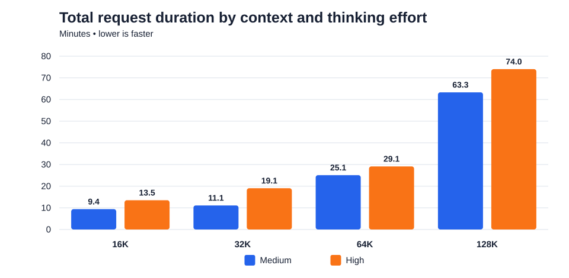
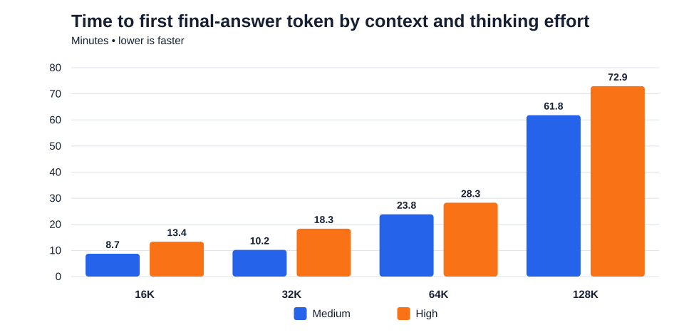

# Thinking-enabled context benchmark (Windows, 2026-09-28)

Eight long requests compared Ollama thinking effort `medium` and `high` at 16K, 32K, 64K and 128K context on the Beelink SER8 (Ryzen 7 8845HS, Radeon 780M, 64 GB RAM). The pinned `qwen3.8:27b-mtp-q4_K_M` model ran on Ollama 0.34.2 with Vulkan, MTP draft 2, six CPU threads, batch 256, f16 KV cache, automatic Flash Attention, one request and one loaded model.

## Latency charts

## Results

`First thinking` is time to the first thinking token. `First answer` is time to the first final-answer token. Generation speed and output token count include both thinking and answer. `done_reason=length` means Ollama reached the shared output-token cap; `stop` means normal completion.

| Context | Effort | Prompt tokens | Retrieval | Thinking chars | Combined output tokens | First thinking | First answer | Total | Combined tok/s | Finish | Peak GPU | Min. RAM GiB | Pauses |
|---|---|---:|---|---:|---:|---:|---:|---:|---:|---|---:|---:|---:|
| 16k | medium | 11,401 | All 3 passed | 7,842 chars | 2,658 | 3m 28s | 8m 45s | 9m 24s | 7.47 | stop | 91 C | 19.37 | 0 |
| 16k | high | 11,443 | All 3 passed | 12,820 chars | 4,096 | 3m 28s | 13m 22s | 13m 31s | 6.80 | length | 91 C | 22.49 | 0 |
| 32k | medium | 26,962 | All 3 passed | 1,421 chars | 640 | 9m 14s | 10m 12s | 11m 07s | 5.67 | stop | 93 C | 21.65 | 0 |
| 32k | high | 27,004 | All 3 passed | 12,297 chars | 3,729 | 9m 12s | 18m 20s | 19m 04s | 6.30 | stop | 93 C | 21.83 | 0 |
| 64k | medium | 56,481 | All 3 passed | 1,375 chars | 680 | 22m 44s | 23m 51s | 25m 06s | 4.80 | stop | 93 C | 19.39 | 0 |
| 64k | high | 56,523 | All 3 passed | 6,042 chars | 2,054 | 22m 36s | 28m 17s | 29m 09s | 5.24 | stop | 93 C | 19.35 | 0 |
| 128k | medium | 113,910 | All 3 passed | 1,167 chars | 629 | 60m 28s | 61m 49s | 63m 19s | 3.67 | stop | 93 C | 14.15 | 0 |
| 128k | high | 113,952 | All 3 passed | 10,646 chars | 3,326 | 60m 42s | 72m 56s | 74m 01s | 4.16 | stop | 93 C | 14.12 | 0 |

All eight runs returned the beginning, middle and end codes. The 16K high run used the full 4,096-token budget (`done_reason=length`): the three codes were present, but its explanatory final answer was cut off. The other seven runs ended normally (`done_reason=stop`). The tests do not compare the quality of medium and high reasoning, because this synthetic retrieval task has a narrow, exact pass condition.

## Evidence

`summary.json` contains aggregate settings and metrics. Each context/effort folder contains request, response, result, placement, memory, temperature and pause records. Stream files omit the model's thinking text. `16k/high` shows the capped response; every `pauses.json` records no pause events. Reproduction commands and run controls are in the repository [benchmarking guide](../../BENCHMARKING.md).
